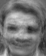
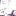

# hw 1: CV & ML Basics
CV & ML Basics [[pdf](hw1.pdf)] [[slides](hw1_intro.pdf)]
* Problem 1: Bayes Decision Rule
* Problem 2: Principal Component Analysis [[link](#principal-component-analysis)]
* Problem 3: Visual Bag-of-Words [[link](#visual-bag-of-Words)]
* Problem 4: Image Filtering [[link](#image-filtering)]

## Principal Component Analysis

### EigenFace
mean | eigen1 | eigen2 | eigen3 | eigen4
--- | --- | --- | --- | ---
 |  |  |  | 
### Face Reconstruction
original | 3 eigens | 45 eigens | 140 eigens| 229 eigens
--- | --- | --- | --- | --- 
   MSE: 0 |    MSE: 1007 |    MSE: 277.3 |    MSE: 22.33 |    MSE: 0.1096

### PCA + KNN
Training Accuracy

k | n | fold1 | fold2 | fold3 | average
--- | --- | --- | --- | --- | ---
1 | 3 | 60.0% | 67.5% | 70.0% | 65.8%
1 | 45 | 90.0% | 86.3% | 90.0% | 88.8%
**1** | **140** | **90.0%** | **88.8%** | **91.3%** | **90.0%**
3 | 3 | 40.0% | 55.0% | 53.8% | 49.6%
3 | 45 | 73.8% | 81.3% | 68.8% | 74.6%
3 | 140 | 72.5% | 81.3% | 70.0% | 74.6%
5 | 3 | 38.8% | 47.5% | 43.8% | 43.3%
5 | 45 | 62.5% | 73.8% | 63.8% | 66.7%
5 | 140 | 58.8% | 73.8% | 58.8% | 63.8%

Testing Accuracy

k | n | Accuracy
--- | --- | ---
**1** | **140** | **94.375%**

## Visual Bag-of-Words

original | patch1 | patch2 | patch3
--- | --- | --- | ---
 |  |  | 
 |  |  | 
 |  |  | 
 |  |  | 

### PCA Subspace

### BoW

banana | fountain | reef | tractor
--- | --- | --- | ---
 |  |  |  

### Testing
Accuracy: 55.6%

## Image Filtering
original | gaussian filtered | derivative_x | derivative_y
--- | --- | --- | ---
 |  |  | 

gradient of original | gradient of gaussian filtered
--- | ---
 | 
