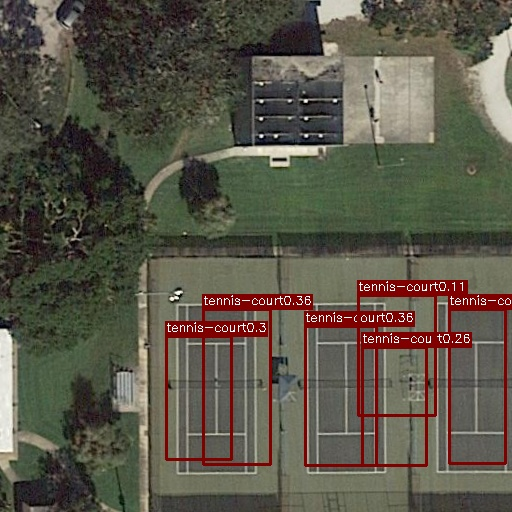
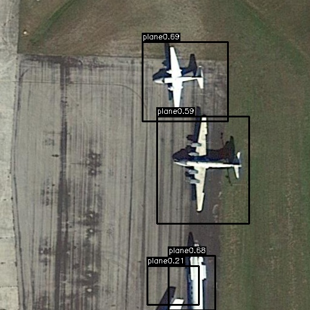

# hw 2: Object Detection in Aerial Images
[Object Detection in Aerial Images](./hw2) [[slides](https://docs.google.com/presentation/d/1CiO0rZzYbPabMjcgDGfRS6V85bRTLvR5cY3jiEngeLc/edit#slide=id.g5528878479_0_54)]

* YOLOv1 [[link](#YOLOv1)]
* YOLOv1_Best [[link](#YOLOv1_best)]

## YOLOv1

### Results
early | middle | final
--- | --- | ---
 |  | 
 |  | 
 |  | 

mAP: 10.5%

## YOLOv1_Best

### Results
early | middle | final
--- | --- | ---
 |  | 
 |  | 
 |  | 

mAP: 13.8%
